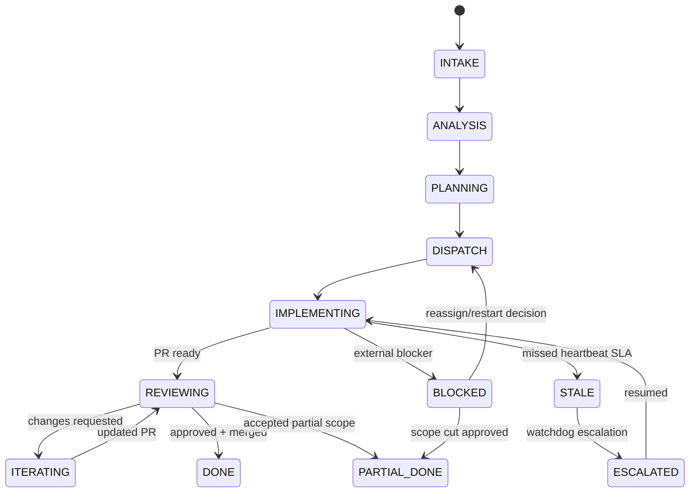

# Codex ↔ Codegen через FastMCP 3.x + Linear + GitHub + @mansion

**Документ:** Final Design (v2, research-backed)  
**Дата:** 2026-02-17  
**Статус:** Ready for implementation planning  
**Язык:** RU (термины API/протоколов сохранены на EN)

## 0. Executive summary

Целевая система: устойчивый manager/implementer конвейер, где:

- **Codex** управляет жизненным циклом большой задачи (intake → decomposition → dispatch → control → review → decisions).
- **Codegen** исполняет подзадачи (branch → code → tests → PR → iteration).
- **Linear** хранит truth по задачам, AC, decision log, блокерам.
- **GitHub** хранит truth по веткам, коммитам, PR, CI.
- **@mansion** является обязательной event-bus шиной между агентами (команды/ACK/status/escalation).
- **FastMCP 3.x** является orchestration runtime: tools, authz, visibility, retries, per-session control, notifications, background tasks.

Ключевой design principle: **нет silent-failure**. Любой сбой переводится в управляемое состояние, фиксируется в Linear, публикуется в @mansion, и приводит к явному решению Codex (retry / resume / split / reassign / partial accept / escalate).

---

## 1. Что фиксируем как hard requirements

1. **No silent stop**: workflow не может зависнуть без watchdog-сигнала и эскалации.
2. **Command idempotency**: повтор команды не должен создавать дублей или ломать состояние.
3. **Dual control plane**: event-driven (@mansion) + poll-driven (Codegen/Linear/GitHub).
4. **Auditability**: любое управленческое решение фиксируется в Linear (decision log).
5. **Branch/PR discipline**: одна подзадача = отдельная ветка и PR.
6. **Partial done is first-class**: разрешено, но только с явным остатком + follow-up issues.
7. **Separation of duties**: права Codex и Codegen ограничиваются ролями и scope’ами.

---

## 2. Документационные constraints (изученные факты)

## 2.1 FastMCP 3.x (важные ограничения/возможности)

1. `enable()/disable()` и теги/keys работают на уровне компонентов; есть allowlist режим `only=True`.
2. Есть **per-session visibility** (`ctx.enable_components()`, `ctx.disable_components()`, `ctx.reset_visibility()`) и автонотификации `tools/resources/prompts list_changed` в affected session.
3. Component-level authorization + `AuthMiddleware`; auth checks могут быть async.
4. Auth token flow полноценно работает на HTTP транспортах (SSE/Streamable HTTP), не на STDIO.
5. Session state (`ctx.set_state/get_state`) персистирует в сессии; backend можно вынести в Redis/store.
6. Background tasks (`task=True` / `TaskConfig`) дают protocol-native async execution; production backend — Redis.
7. Lifespan 3.0 запускается один раз на server instance; используется для shared clients, queues, cleanup.
8. Provider/transform архитектура 3.0 позволяет modular composition и namespace control.

## 2.2 Codegen (API и operational behavior)

1. Основные API для orchestration:
   - `POST /v1/organizations/{org_id}/agent/run`
   - `GET /v1/organizations/{org_id}/agent/run/{agent_run_id}`
   - `GET /v1/organizations/{org_id}/agent/runs`
   - `POST /v1/organizations/{org_id}/agent/run/resume`
2. Create rate limit: 10 req/min; standard read endpoints: 60 req/30s (по docs overview).
3. `CreateAgentRunInput` поддерживает `prompt`, `repo_id`, `metadata`, `model`, `agent_type`.
4. `AgentRunResponse` содержит `status` (string), `result`, `summary`, `github_pull_requests`, `metadata`.
5. Logs endpoint `GET /v1/alpha/.../agent/run/{id}/logs` помечен как **ALPHA** (формат может меняться).
6. По SDK/docs встречаются статусы `queued`, `in_progress`, `completed`, `failed`; в UI/CLI также есть uppercase варианты (`RUNNING`, `PENDING`, `FAILED`, `COMPLETE`, etc.). Нужна нормализация.
7. Интеграции подтверждают целевой behavior: Linear updates/comments, GitHub branch/PR/check monitoring, interrupt messages.

## 2.3 Codex/OpenAI docs (операционные правила для manager-agent)

1. `AGENTS.md` загружается с chain precedence (global + project path depth), поэтому policy надо хранить в repo-level AGENTS.
2. Codex skills используют progressive disclosure; можно выделить orchestration skills (intake/decompose/review/escalation).
3. Codex MCP config поддерживает required servers, enabled/disabled tools, timeout knobs.
4. Codex может работать как MCP server (`codex mcp-server`) с `codex` и `codex-reply` tool calls; это позволяет вложенные multi-agent workflows.
5. Rules (`prefix_rule`) позволяют enforced shell safety для manager-процессов.
6. App-server protocol подтверждает event-driven модель thread/turn/item + approval hooks как reference pattern для нашей event шины.

## 2.4 Архитектурные выводы

1. Orchestration runtime надо запускать по HTTP (не только STDIO), иначе authz/role separation неполные.
2. Visibility feature в FastMCP 3.0 подходит для incident mode / degraded mode без redeploy.
3. Codegen status и logs надо воспринимать как **eventually consistent** и частично нестабильные по schema: слой адаптера обязан нормализовать.

---

## 3. Target architecture

```mermaid
flowchart TB
    U[User] --> MANSION[@mansion room]

    subgraph ORCH[FastMCP 3.x Orchestration Server]
      COD[Codex Manager Runtime]
      WD[Watchdog Service]
      DEC[Decision Engine]
      ADP1[Mansion Adapter]
      ADP2[Linear Adapter]
      ADP3[Codegen Adapter]
      ADP4[GitHub Adapter]
      STORE[(State Store / Redis)]
    end

    MANSION <--> ADP1
    COD <--> DEC
    COD <--> WD
    WD <--> STORE
    COD <--> STORE

    ADP2 <--> LIN[Linear]
    ADP3 <--> CG[Codegen API]
    ADP4 <--> GH[GitHub API]

    CG --> GH
    CG --> LIN
```

### 3.1 Границы ответственности

- **Codex Manager Runtime**: intake/decomposition/dispatch/review/decision.
- **Watchdog Service**: heartbeat SLA, stale detection, escalation triggers.
- **Decision Engine**: transition policy + recovery playbooks.
- **Adapters**: чистые integration boundaries с retry/idempotency/circuit-breaker.
- **State Store**: workflow state, dedup keys, retry ledger, heartbeat timestamps.

---

## 4. Source of truth и consistency model

## 4.1 SoT

- **Linear**: task lifecycle, acceptance criteria, blockers, decisions.
- **GitHub**: code state (branches/commits/PR/checks).
- **@mansion**: operational event stream и ACK transport.

## 4.2 Consistency

- Orchestrator использует **eventual consistency** между Linear/GitHub/Codegen/@mansion.
- Любая важная команда и статус подтверждаются минимум двумя сигналами:
  - event signal (mansion) + data-plane verification (poll API).

---

## 5. Core domain model

## 5.1 WorkflowRun

```yaml
workflow_run_id: string
epic_linear_id: string
status: INTAKE|ANALYSIS|PLANNING|DISPATCH|IMPLEMENTING|REVIEWING|ITERATING|DONE|PARTIAL_DONE|BLOCKED|STALE|ESCALATED
created_at: datetime
updated_at: datetime
owner: codex
priority: P0..P3
sla:
  heartbeat_interval_sec: 300
  stale_after_sec: 900
  hard_timeout_sec: 21600
```

## 5.2 WorkOrder

```yaml
work_order_id: string
workflow_run_id: string
linear_issue_id: string
repo: org/repo
base_branch: main
target_branch: codegen/<ISSUE-ID>-<slug>
definition_of_done: string
acceptance_criteria: [string]
constraints:
  branch_policy: string
  testing_policy: string
  review_policy: string
idempotency_key: string
dispatch_attempt: int
```

## 5.3 ExecutionRecord

```yaml
codegen_run_id: int
status_raw: string
status_normalized: QUEUED|RUNNING|PAUSED|COMPLETED|FAILED|CANCELLED|UNKNOWN
pr_numbers: [int]
latest_summary: string
latest_result: string
last_heartbeat_at: datetime
last_event_id: string
```

## 5.4 DecisionLogEntry

```yaml
decision_id: string
workflow_run_id: string
issue_id: string
decision_type: ITERATE|SPLIT|ACCEPT_PARTIAL|REASSIGN|ESCALATE|ABORT
rationale: string
trigger: EVENT|POLL|TIMEOUT|MANUAL
author: codex
timestamp: datetime
links:
  linear_comment_url: string
  mansion_message_id: string
```

---

## 6. @mansion protocol (final contract)

## 6.1 Envelope

```json
{
  "message_id": "uuid",
  "workflow_run_id": "wf_...",
  "linear_issue_id": "LIN-123",
  "type": "WORK_ORDER",
  "attempt": 1,
  "idempotency_key": "wf_...:LIN-123:work_order:v1",
  "timestamp": "2026-02-17T12:34:56Z",
  "sender": "codex",
  "payload": {}
}
```

## 6.2 Message types

- `WORKFLOW_START`
- `WORK_ORDER`
- `ACK`
- `STATUS_UPDATE`
- `PING`
- `PONG`
- `ESCALATE`
- `DECISION`
- `DONE`
- `PARTIAL_DONE`
- `ERROR_REPORT`

## 6.3 ACK rules

1. `WORK_ORDER`, `DECISION`, `ESCALATE`, `ERROR_REPORT` требуют ACK.
2. ACK timeout: `60s` (configurable).
3. Нет ACK → retry с backoff (`1m`, `2m`, `4m`, `8m`, max `5 tries`).
4. При retry используется тот же `idempotency_key`.
5. После max retry: auto `ESCALATE` + incident comment в Linear.

## 6.4 Dedup rules

- dedup key: `(sender, idempotency_key)`.
- duplicate message должен возвращать предыдущий результат обработки (at-least-once delivery semantics).

## 6.5 Heartbeat SLA

- Codegen обязан публиковать `STATUS_UPDATE` каждые `X=5` минут.
- `stale_after = 3 * X = 15` минут.
- В `STALE` orchestrator запускает recovery ladder:
  1. `PING` в mansion.
  2. `codegen_get_run`.
  3. Проверка Linear/GitHub активности.
  4. `codegen_resume_run` или re-dispatch.
  5. `ESCALATE` + decision record.

---

## 7. State machine

## 7.1 WorkflowRun FSM



## 7.2 Normalized Codegen run states

```text
RAW (examples): queued, in_progress, RUNNING, PENDING, COMPLETE, completed, failed, ERROR, STOPPED
→ NORMALIZED:
  queued|PENDING -> QUEUED
  in_progress|RUNNING|ACTIVE -> RUNNING
  paused|stopped -> PAUSED
  completed|COMPLETE -> COMPLETED
  failed|ERROR -> FAILED
  cancelled -> CANCELLED
  else -> UNKNOWN
```

## 7.3 Gate checks per transition

- `DISPATCH -> IMPLEMENTING`: `ACK(work_order)` обязателен.
- `IMPLEMENTING -> REVIEWING`: есть PR URL + Linear comment + минимум один STATUS_UPDATE.
- `REVIEWING -> DONE`: PR merged + all AC checked in Linear.
- `ANY -> PARTIAL_DONE`: есть явный остаток scope + follow-up issue ids.

---

## 8. End-to-end orchestration lifecycle

## 8.1 Intake

Codex получает объемную постановку и формирует:

- problem statement
- scope boundaries (in/out)
- constraints
- acceptance criteria draft
- risk draft

### Output

- Epic draft в Linear
- `WORKFLOW_START` в @mansion

## 8.2 Analysis & decomposition

Codex делит epic на atomic issues:

- 1 issue = 1 deliverable = 1 PR
- issue template строгий (контекст, план, AC, риски, deps, DoD)
- labels: `agent:codegen`, `agent:codex` + state labels

## 8.3 Dispatch

На каждую issue Codex формирует `WORK_ORDER` и запускает Codegen run.

**Codegen create payload (минимум):**

```json
{
  "prompt": "...task instructions...",
  "repo_id": 123,
  "metadata": {
    "workflow_run_id": "wf_...",
    "linear_issue_id": "LIN-123",
    "idempotency_key": "wf_...:LIN-123:run:create:v1"
  },
  "agent_type": "codegen"
}
```

## 8.4 Implementing control loop

Параллельно работают 2 канала:

1. **Event loop:** poll @mansion и обрабатывает `STATUS_UPDATE`, `ERROR_REPORT`, `DONE/PARTIAL_DONE`.
2. **Verification loop:** с периодом `N` минут проверяет Codegen run + PR checks + Linear comments.

Любое расхождение event/data-plane помечается как `CONSISTENCY_WARNING` и фиксируется в decision log.

## 8.5 Review loop

Codex выполняет ревью по шаблону:

- AC completeness
- correctness / regressions / edge cases
- tests quality
- observability
- security

Выход:

- PR comments
- `DECISION` в @mansion
- update в Linear (`In Review` / `In Progress` / `Done`)

## 8.6 Completion

`DONE`:

- PR merged
- Linear issue Done
- decision log finalized

`PARTIAL_DONE`:

- PR merged or draft accepted by policy
- остаток scope вынесен в follow-up issues
- принято управленческое решение `ACCEPT_PARTIAL`

---

## 9. FastMCP server blueprint (for this system)

## 9.1 Providers

- `LocalProvider`: orchestration tools (`workflow/*`, `watchdog/*`, `decision/*`).
- `ProxyProvider` / adapter tools для внешних API (Linear, Codegen, GitHub, Mansion).
- optional `SkillsDirectoryProvider` для manager playbooks.

## 9.2 Transforms

- `Namespace` transforms:
  - `mgr_*` (Codex manager tools)
  - `impl_*` (Codegen-facing tools)
- `PromptsAsTools` и `ResourcesAsTools` для tool-only clients.
- optional `VersionFilter` для rollout новых инструментов.

## 9.3 Visibility design

- Глобально скрыты опасные или аварийные инструменты (`dispatch`, `resume-force`, `manual-override`).
- При incident response Codex включает нужный namespace per-session через `ctx.enable_components(...)`.
- Возврат к baseline через `ctx.reset_visibility()`.

## 9.4 Authz design

- Component-level `auth=require_scopes(...)` для критичных tools.
- `AuthMiddleware` для server-wide policy:
  - role `manager`: can plan/dispatch/decide
  - role `implementer`: can report/update, no policy override
  - role `observer`: read-only

**Важно:** auth tokens и scope enforcement требуют HTTP transport.

## 9.5 Background tasks

Task-enabled components для долгих операций:

- `workflow.wait_for_codegen_run`
- `watchdog.monitor`
- `review.await_checks`

`TaskConfig(mode="optional")` + Redis backend в production.

## 9.6 Middleware chain

1. `ErrorHandlingMiddleware`
2. `AuthMiddleware`
3. `RateLimitMiddleware`
4. `ObservabilityMiddleware`
5. `IdempotencyMiddleware`
6. Domain middlewares (decision auditing)

---

## 10. MCP tool contract (final v2)

## 10.1 Mansion

- `mansion.post(room, message, idempotency_key) -> {message_id}`
- `mansion.poll(room, since, timeout_sec) -> {events[], cursor}`
- `mansion.ack(message_id, status, reason?) -> {ok}`
- `mansion.create_room(name, metadata?) -> {room_id}`

## 10.2 Linear

- `linear.create_epic(...)`
- `linear.create_issue(...)`
- `linear.update_issue(...)`
- `linear.comment_issue(...)`
- `linear.search_issues(query)`
- `linear.append_decision_log(issue_id, decision)` (thin wrapper над comments/doc)

## 10.3 Codegen

- `codegen_run_agent(prompt, repo_id, metadata) -> {run_id}`
- `codegen_get_run(run_id) -> {status,result,summary,prs,metadata}`
- `codegen_resume_run(run_id, prompt) -> {status}`
- `codegen_list_runs(filters) -> {items,page}`
- `codegen_get_run_logs(run_id, skip, limit, reverse?) -> {logs}` (alpha, best-effort)

## 10.4 GitHub

- `github.create_branch(repo, base, name)`
- `github.create_pr(repo, branch, title, body)`
- `github.get_pr_status(pr)`
- `github.comment_pr(pr, comment)`
- `github.get_pr_checks(pr)`
- `github.merge_pr(pr, strategy)`

## 10.5 Workflow/watchdog internal

- `workflow.start(input)`
- `workflow.get(id)`
- `workflow.advance(id, event)`
- `watchdog.tick(workflow_run_id)`
- `watchdog.escalate(workflow_run_id, reason)`
- `decision.record(workflow_run_id, decision)`

---

## 11. Reliability policy (no-silence design)

## 11.1 Retry policy

- Exponential backoff + jitter для внешних API.
- Retry classes:
  - retryable: network timeouts, 429, transient 5xx
  - non-retryable: 4xx validation/authz errors

## 11.2 Circuit breakers

Per integration (`codegen`, `linear`, `github`, `mansion`):

- `closed` → `open` после `N` failures
- в `open` выполняется degrade mode (read-only checks + escalate)
- half-open probe через cooldown

## 11.3 Degraded modes

1. **Mansion down**: continue poll-driven verification, все решения пишутся в Linear, периодический retry publish backlog.
2. **Codegen API degraded**: stop new dispatch, только monitor/resume existing, escalate to manual.
3. **GitHub degraded**: stop merge actions, hold in `In Review`, log blocker.
4. **Linear degraded**: запрещаем state transitions без local journal; потом replay.

## 11.4 Error taxonomy

- `INTEGRATION_ERROR`
- `PROTOCOL_ERROR`
- `STATE_CONFLICT`
- `AUTHZ_ERROR`
- `SLA_BREACH`
- `MANUAL_INTERVENTION_REQUIRED`

Каждая ошибка порождает `ERROR_REPORT` + Linear incident comment.

---

## 12. Review and decision protocol

## 12.1 Review severity

- `P0`: security/data-loss/corruption
- `P1`: functional breakage / AC miss
- `P2`: maintainability/perf risk
- `P3`: style/minor improvements

## 12.2 Decision types

- `APPROVE_MERGE`
- `REQUEST_CHANGES`
- `ITERATE`
- `SPLIT_SCOPE`
- `ACCEPT_PARTIAL`
- `REASSIGN`
- `ESCALATE_HUMAN`

Каждое решение обязано содержать:

- reason
- expected next action
- owner
- due timestamp

---

## 13. Security and compliance

1. Принцип минимальных прав для token’ов на каждый adapter.
2. Secret storage только через env/secret manager; не в payload logs.
3. PII redaction в observability pipeline.
4. Подпись idempotency + correlation ids на все критичные сообщения.
5. Authz separation (manager vs implementer scopes).
6. Audit trail immutable append-only (workflow_journal).

---

## 14. Observability and SLO

## 14.1 SLI

- `workflow_success_rate`
- `mean_time_to_first_ack`
- `heartbeat_gap_seconds`
- `stale_incidents_per_100_runs`
- `mean_time_to_recovery`
- `decision_latency`
- `pr_cycle_time`

## 14.2 SLO (initial)

- ACK critical messages ≤ 60s in 99%.
- Stale detection ≤ 15 min.
- Escalation emission ≤ 2 min после stale detection.
- Decision log write success ≥ 99.9%.

## 14.3 Logging schema (minimum)

```json
{
  "ts": "...",
  "workflow_run_id": "wf_...",
  "issue_id": "LIN-123",
  "correlation_id": "corr_...",
  "component": "watchdog",
  "event": "HEARTBEAT_MISSED",
  "severity": "WARN",
  "payload": {}
}
```

---

## 15. Test strategy

1. **Contract tests** для каждого adapter tool.
2. **FSM tests**: валидные/невалидные transition paths.
3. **Idempotency tests**: duplicate delivery + replay.
4. **Integration tests**: sandbox env с fake mansion + mock codegen/linear/github.
5. **Chaos tests**:
   - drop every N-th event
   - delayed ACK
   - 429 bursts
   - temporary API outages
6. **Recovery drills** weekly: stale→escalate→resume сценарий.

---

## 16. Operational runbooks

## 16.1 Runbook: Missed heartbeat

1. mark workflow `STALE`.
2. emit `PING`.
3. poll codegen run + PR checks + Linear activity.
4. if active in data-plane: recover to `IMPLEMENTING`.
5. else attempt `resume`.
6. if resume failed: `ESCALATE` + incident + decision required.

## 16.2 Runbook: PR checks failing repeatedly

1. verify failed checks via GitHub API.
2. create `DECISION: ITERATE` and send to Codegen.
3. cap retries (default 3).
4. after cap: `SPLIT_SCOPE` or `ESCALATE_HUMAN`.

## 16.3 Runbook: Linear-GitHub link missing

1. detect missing PR link in issue comments/attachments.
2. auto-post corrective comment with PR URL.
3. if failed 3 times, create incident label `link-sync-failed`.

---

## 17. Definition of done for architecture

Architecture считается принятой, когда:

1. Happy-path от intake до merged PR работает end-to-end.
2. Есть подтвержденный сценарий восстановления после потери heartbeat.
3. Duplicate command не вызывает повторного side-effect.
4. Любое `ESCALATE` и `DECISION` попадают и в @mansion, и в Linear.
5. Observability dashboard показывает SLI/SLO в реальном времени.

---

## 18. Open decisions (to confirm before implementation)

1. Оставляем ли @mansion как отдельный сервис или как plugin поверх существующего чата?
2. Требуется ли строгий exactly-once (дорого) или подтвержденный at-least-once достаточно?
3. Merge strategy: squash-only или разрешить rebase merge?
4. Нужна ли automated merge при passing checks или только после явного manager decision?
5. Нужен ли multi-repo workflow в первой версии?

---

## 19. Primary sources

### Codegen

- [Codegen docs llms-full](https://docs.codegen.com/llms-full.txt)
- [Codegen docs repo (develop/docs)](https://github.com/codegen-sh/codegen/tree/develop/docs)
- [Codegen source (develop/src/codegen)](https://github.com/codegen-sh/codegen/tree/develop/src/codegen)
- [Codegen API overview](https://docs.codegen.com/api-reference/overview)
- [Create agent run](https://docs.codegen.com/api-reference/agents/create-agent-run)
- [Get agent run](https://docs.codegen.com/api-reference/agents/get-agent-run)
- [Resume agent run](https://docs.codegen.com/api-reference/agents/resume-agent-run)
- [Agent run logs](https://docs.codegen.com/api-reference/agent-run-logs)
- [Linear integration](https://docs.codegen.com/integrations/linear)
- [GitHub integration](https://docs.codegen.com/integrations/github)
- [MCP integrations](https://docs.codegen.com/integrations/mcp)
- [MCP servers integration](https://docs.codegen.com/integrations/mcp-servers)

### FastMCP

- [FastMCP llms-full](https://gofastmcp.com/llms-full.txt)
- [FastMCP docs](https://github.com/jlowin/fastmcp/tree/main/docs)
- [FastMCP examples](https://github.com/jlowin/fastmcp/tree/main/examples)
- [FastMCP skills/fastmcp-client-cli](https://github.com/jlowin/fastmcp/tree/main/skills/fastmcp-client-cli)
- [Visibility](https://gofastmcp.com/servers/visibility)
- [Authorization](https://gofastmcp.com/servers/authorization)
- [Context](https://gofastmcp.com/servers/context)
- [Background tasks](https://gofastmcp.com/servers/tasks)
- [Progress](https://gofastmcp.com/servers/progress)
- [Lifespan](https://gofastmcp.com/servers/lifespan)
- [Mounting](https://gofastmcp.com/servers/providers/mounting)

### OpenAI Codex docs

- [Codex skills](https://developers.openai.com/codex/skills.md)
- [AGENTS.md guide](https://developers.openai.com/codex/guides/agents-md.md)
- [Codex MCP](https://developers.openai.com/codex/mcp.md)
- [Codex rules](https://developers.openai.com/codex/rules.md)
- [Codex + Agents SDK guide](https://developers.openai.com/codex/guides/agents-sdk.md)
- [Codex app-server](https://developers.openai.com/codex/app-server.md)

